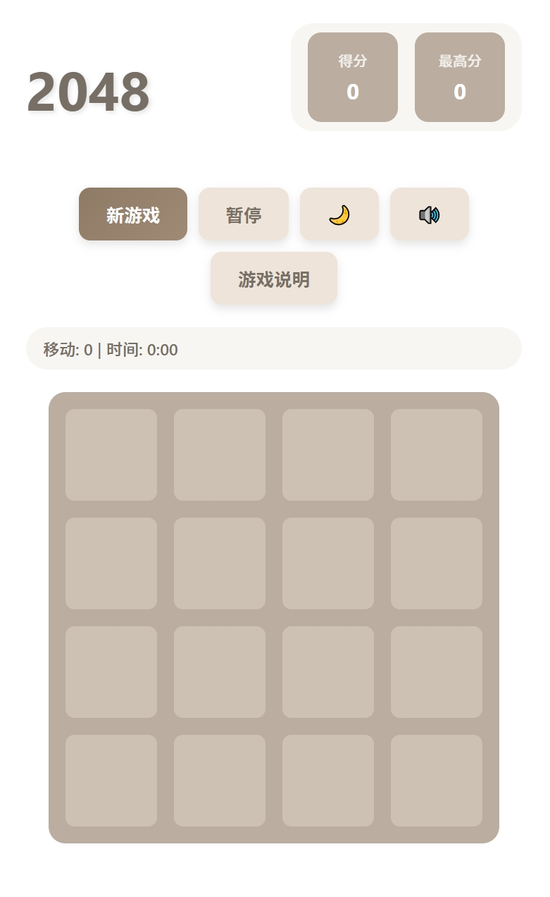

# 2048 经典游戏

一个现代化的2048游戏实现，支持多平台（桌面端和移动端），具备丰富的功能和优雅的用户界面。



## 🎮 项目特色

### 核心功能
- **经典2048游戏玩法** - 合并相同数字方块，目标是达到2048
- **暂停/恢复功能** - 支持空格键快速暂停和继续游戏
- **实时游戏统计** - 追踪移动次数和游戏时间
- **最高分记录** - 本地存储历史最高分

### 界面设计
- **明暗主题切换** - 支持浅色和深色主题
- **响应式设计** - 完美适配桌面端和移动端
- **优雅的动画效果** - 方块移动和合并动画
- **自定义说明模态框** - 详细的游戏说明和规则介绍

### 用户体验
- **音效系统** - 支持音效开关（移动、合并、胜利、游戏结束）
- **触摸控制** - 移动端虚拟按钮控制
- **键盘支持** - 方向键移动，空格键暂停
- **实时计时** - 暂停期间时间不计算，精确的游戏时间统计

## 🚀 在线体验

直接访问部署版本：[2048 Game Live Demo](http://localhost:8080/2048.html)

## 📁 项目结构

```
2048-game/
├── 2048.html          # 主页面结构
├── 2048-script.js     # 游戏核心逻辑
├── 2048-style.css     # 样式和主题
├── README.md          # 项目说明文档
├── screenshot.png     # 游戏截图（可选）
├── LICENSE            # MIT许可证
└── screenshot.png     # 游戏截图
```

## 🛠️ 技术栈

- **前端技术**：HTML5, CSS3, JavaScript (ES6+)
- **音频处理**：Web Audio API
- **数据存储**：localStorage (浏览器本地存储)
- **响应式设计**：CSS Flexbox + Grid
- **动画效果**：CSS Animations + JavaScript

## 🎯 游戏规则

1. **目标**：创建带有数字2048的方块
2. **操作方式**：
   - 桌面端：使用方向键（↑↓←→）移动方块
   - 桌面端：按空格键快速暂停/继续游戏
   - 移动端：点击虚拟按钮移动方块
3. **游戏机制**：
   - 每次移动后，在空白处随机出现数字2或4
   - 当两个相同数字的方块碰撞时，它们会合并成一个
   - 合并后的方块数字是原来数字的两倍
   - 当无法移动时游戏结束
4. **得分系统**：每次合并都会获得分数，合并后的数字就是获得的分数

## 🎨 功能特性详解

### 主题系统
- **浅色主题**（默认）：清爽的白色背景
- **深色主题**：护眼的深色界面
- 一键切换，实时应用

### 音效系统
- **移动音效**：方块移动时的提示音
- **合并音效**：方块合并时的庆祝音
- **胜利音效**：达到2048时的胜利音乐
- **游戏结束音效**：游戏结束时的提示音
- 支持一键开关音效

### 暂停功能
- **键盘暂停**：空格键快速暂停/继续
- **按钮暂停**：点击暂停按钮
- **智能时间计算**：暂停期间不计算游戏时间
- **暂停界面**：优雅的暂停提示界面

### 游戏统计
- **移动次数**：实时显示玩家移动次数
- **游戏时间**：精确的游戏时间计时（排除暂停时间）
- **最高分记录**：自动保存和显示历史最高分

## 🖥️ 使用方法

### 本地运行

1. **下载项目文件**
   ```bash
   git clone [项目地址]
   cd 2048-game
   ```

2. **启动本地服务器**
   ```bash
   # 使用Python
   python -m http.server 8080
   
   # 或使用Node.js
   npx serve .
   
   # 或使用PHP
   php -S localhost:8080
   ```

3. **访问游戏**
   打开浏览器访问：`http://localhost:8080/2048.html`

### 在线部署

可以直接部署到任何静态文件托管服务：
- GitHub Pages
- Netlify
- Vercel
- Firebase Hosting

## 🎮 操作指南

### 桌面端操作
- **↑↓←→** - 移动方块
- **空格键** - 暂停/继续游戏
- **鼠标点击** - 使用界面按钮

### 移动端操作
- **虚拟按钮** - 点击屏幕上的方向按钮
- **触摸支持** - 响应式触摸操作

### 界面按钮
- **新游戏** - 重新开始游戏
- **暂停** - 暂停/继续游戏
- **主题** - 切换明暗主题
- **音效** - 开启/关闭音效
- **游戏说明** - 查看详细游戏规则

## 🏆 游戏提示

1. **策略规划**：提前规划方块的移动路径
2. **角落策略**：将最大数字放在角落
3. **顺序排列**：保持数字从大到小的排列顺序
4. **避免混乱**：不要随意移动，保持棋盘整洁
5. **耐心等待**：有时等待合适的时机比急躁移动更重要

## 🔧 开发说明

### 自定义配置
可以在 `2048-script.js` 中修改以下配置：
```javascript
// 游戏板大小（默认4x4）
this.size = 4;

// 初始方块数量
this.addRandomTile();
this.addRandomTile(); // 调用两次

// 音效频率设置
this.sounds = {
    move: this.createBeepSound(200, 0.1),
    merge: this.createBeepSound(400, 0.2),
    // ...
};
```

### 样式自定义
在 `2048-style.css` 中可以修改：
- 主题色彩方案
- 动画效果
- 响应式断点
- 字体和间距

## 📱 浏览器兼容性

- ✅ Chrome 60+
- ✅ Firefox 55+
- ✅ Safari 12+
- ✅ Edge 79+
- ✅ iOS Safari 12+
- ✅ Android Chrome 60+

## 🤝 贡献指南

欢迎提交Issue和Pull Request来改进这个项目！

### Git 工作流程

**1. 首次设置**
```bash
git clone [项目地址]
cd 2048-game
git config user.name "Your Name"
git config user.email "your.email@example.com"
```

**2. 创建特性分支**
```bash
# 创建并切换到新分支
git checkout -b feature/improve-animations
# 或者
git checkout -b bugfix/fix-timer-issue
# 或者
git checkout -b enhancement/add-new-theme
```

**3. 提交更改**
```bash
git add .
git commit -m "feat: add smooth tile animations"
# 或者
git commit -m "fix: resolve pause timer calculation"
# 或者  
git commit -m "style: improve dark theme colors"
```

**4. 推送到远程**
```bash
git push origin feature/improve-animations
```

**5. 创建Pull Request**
在GitHub上为您的分支创建一个Pull Request，等待审核。

### 提交消息规范
- `feat:` 新功能
- `fix:` 修复bug
- `style:` 样式修改
- `docs:` 文档更新
- `refactor:` 代码重构
- `test:` 测试相关
- `chore:` 构建/工具相关

## 📄 许可证

本项目基于 MIT 许可证开源 - 查看 [LICENSE](LICENSE) 文件了解详情

## 🙏 致谢

- 感谢Gabriele Cirulli创造了原始的2048游戏
- 感谢所有为开源社区贡献的开发者和设计师
- 感谢测试用户提供的宝贵反馈

---

**享受游戏，挑战2048！** 🎮✨

如有问题或建议，欢迎提交Issue或Pull Request。
